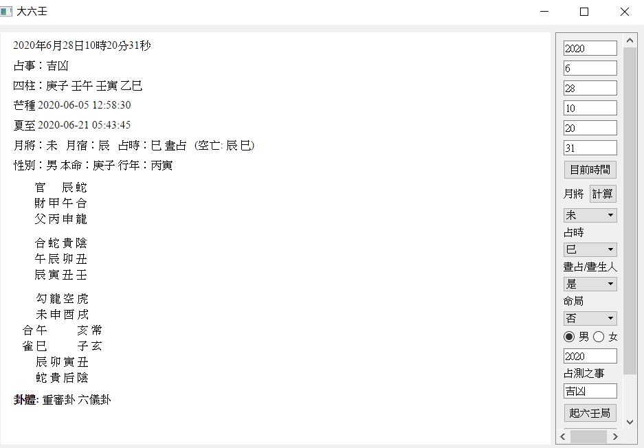

## 大六壬（DaLiuRen）/六壬神課（りくじんしんか） for Python

此為[dalurenpython](https://github.com/wlhyl/dalurenpython)的繁體中文版本，加入語言及格式之修改，運算皆同。

### 安裝步驟
1. 下載.zip檔，並解壓縮後進入該目錄
2. 將`requirements.txt`的`ganzhiwuxin==0.1`註解掉，並參考下方安裝`ganzhiwuxin`
3. 安裝必要套件`pip install -r requirements.txt`
4. 啟動GUI界面`python main.py`

### 常見問題

- 找不到`ganzhiwuxin==0.1`
  - 請至此安裝[ganzhiwuxinForPython](https://github.com/wlhyl/ganzhiwuxinForPython)
  - 或是直接透過pip安裝`pip install https://github.com/wlhyl/ganzhiwuxinForPython/archive/refs/heads/master.zip`
- `error: Microsoft Visual C++ 14.0 is required. Get it with "Microsoft Visual C++ Build Tools": https://visualstudio.microsoft.com/downloads/`
  - 參閱[此文章](https://hjwang520.pixnet.net/blog/post/404280185-%E5%AE%89%E8%A3%9Dmicrosoft-visual-c%2B%2B-14.0)安裝Microsoft Visual C++ 14.0即可
