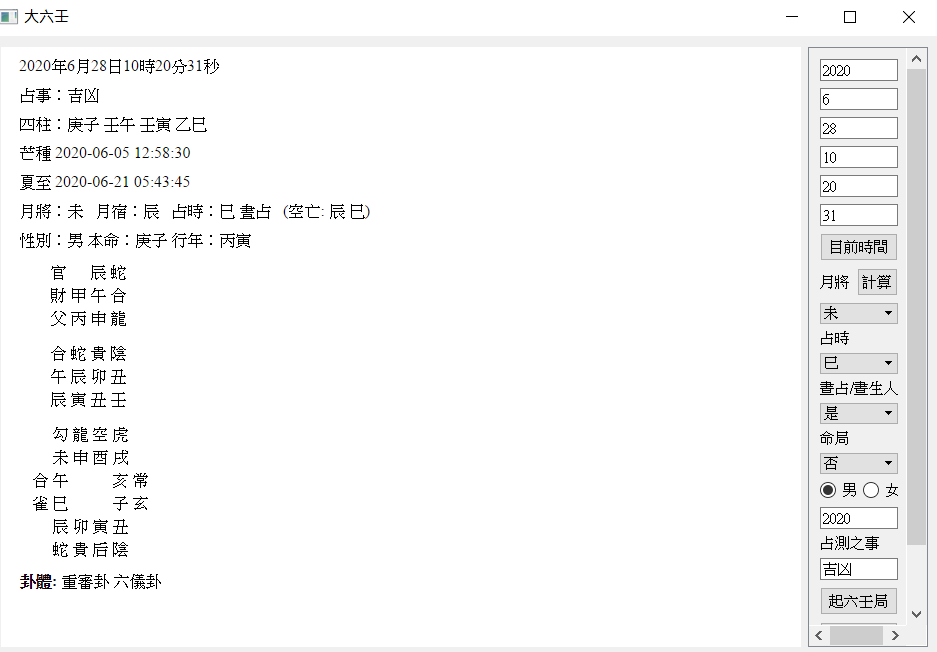

> **重要通知：本專案已停止維護**
> 
> 本專案（daliurenpython-zh-tw）之核心架構已全面升級並移轉。後續的所有功能更新、Bug 修復以及現代化 Web 介面開發，將全數接續在全新專案 [daliuren-web-engine](https://github.com/d1210182010/daliuren-web-engine) 進行。
> 

本專案嚴格遵循大六壬的運算邏輯，將傳統數術與現代天文計算法相結合 。此版本為 [dalurenpython](https://github.com/wlhyl/dalurenpython) 的繁體中文優化版，在原始精確運算的基礎上，優化了語言呈現與格式輸出，更重要的是將貴人取法由「陰陽分旦暮」調整為主流的「甲戊庚牛羊」。

以下是我針對本專案特點條列的說明：

---
# daliurenpython

## 核心運算邏輯

本系統的運算核心建立在將具體事物「質點化」的基礎上，透過時空參數的建立，重現大六壬的預測機理 。

### 1. 天機發端 (起課與定位)

* **時間參數**：程式允許輸入特定的年、月、日、時，作為事物運動軌跡上的發端點 。
* **起局模式**：支援「固定時」（目前時間）與「活動時」（隨機取數）兩種起課邏輯 。
* **子時處理**：系統嚴格執行子時跨日邏輯。凡小時數為 23 點至 1 點者，日柱自動更新為隔日，確保日干支的準確性。

### 2. 歷法與月將計算

* **精確節氣比對**：系統內建跨年節氣表（收集 y-1 至 y+1 三年數據），確保年初節氣跳轉時不產生誤差。
* **月將判定**：
  * 採用「月支六合」為基礎判定月將 。
  * 執行「過氣換將」邏輯：若占時尚未超過該月「中氣」，月將會自動進一位，體現月將定「月之氣」的原則 。
* **重大 Bug 修正**：
  * 修正了 `GetLi` 函數在「小寒」到「大寒」節氣區間內會錯誤將年度 +1 的邏輯問題，解決了該時段月將錯置的計算偏差。

### 3. 四課與三傳生成 (四象與變異)

* **四課定位**：根據日干支確立主（日）客（辰）關係，分別生成干上陽神、干上陰神、支上陽神、支上陰神 。
* **九宗三傳**：根據四課之中的「克」數與性質（下克上、上克下、比用、涉害等），推導三傳（初傳、中傳、末傳）以反映事物的轉折與結局 。
* **動靜分析**：天盤代表發動（動），地盤代表歸宿（靜） 。

### 4. 氣數與旺衰系統
* **旺相休囚判定**：內建四季五行強弱計算。依據「得時我旺、我生者相、生我者休、克我者囚、我克者死」的原則衡量氣數 。
* **神將情狀轉換**：將十二神（貴人至天后）與六親（父母、官鬼等）結合，將抽象五行轉化為具體的人事語言 。

---

## 安裝與使用指南

### 安裝步驟

1. **下載原始碼**：下載本專案的 `.zip` 檔並解壓縮，進入該目錄。
2. **處理相依套件**：
  * 打開 `requirements.txt`。
  * 將 `ganzhiwuxin==0.1` 註解掉（在前面加上 `#`）。
3. **安裝必要環境**：
  * 執行 `pip install -r requirements.txt`。
  * 另外安裝 [ganzhiwuxinForPython](https://github.com/wlhyl/ganzhiwuxinForPython)。
4. **啟動程式**：
  * 執行 `python main.py` 啟動 GUI 界面。

### 操作步驟

1. **輸入時間**：在介面右側面板輸入西元年度、月份、日期、小時與分鐘。
2. **計算月將**：點擊「計算」按鈕，系統會根據歷法自動判斷當前月將與占時。
3. **設定參數**：
  * **晝夜占**：根據起課時辰選擇晝夜，影響貴人起例 。
  * **命局/事占**：選擇進行「命占」（個體命運）或「事占」（具體事件） 。
4. **生成盤面**：點擊「起六壬局」，系統將生成完整的 HTML 格式盤面。

---

## 技術說明與常見問題

### 常見問題排解

* **找不到 `ganzhiwuxin`**：
  * 請確保已手動安裝 [ganzhiwuxinForPython](https://github.com/wlhyl/ganzhiwuxinForPython)。
* **編譯錯誤 (Microsoft Visual C++ 14.0 is required)**：
  * 這是由於 Python 套件編譯需要 C++ 環境。請安裝 [Microsoft Visual C++ Build Tools](https://visualstudio.microsoft.com/downloads/)。

### 技術特色

* **字體修正**：程式內建轉換邏輯，並針對大六壬專有名詞進行修正（例如：將自動轉換產生的「醜」修正為「丑」，「佔」修正為「占」），確保數術術語的專業性。
* **天文模型**：月亮黃經計算採用 `elp82` 高精度天文數據，確保星象定位準確。
